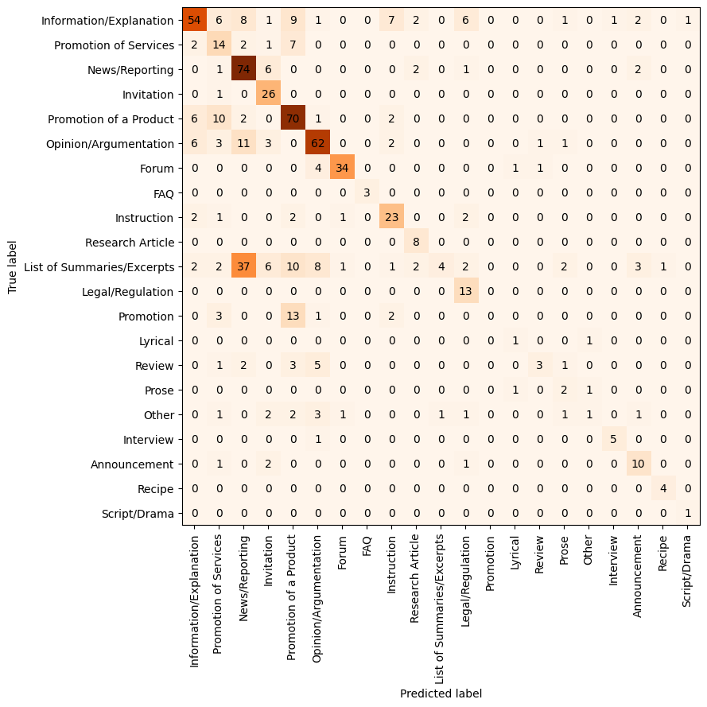
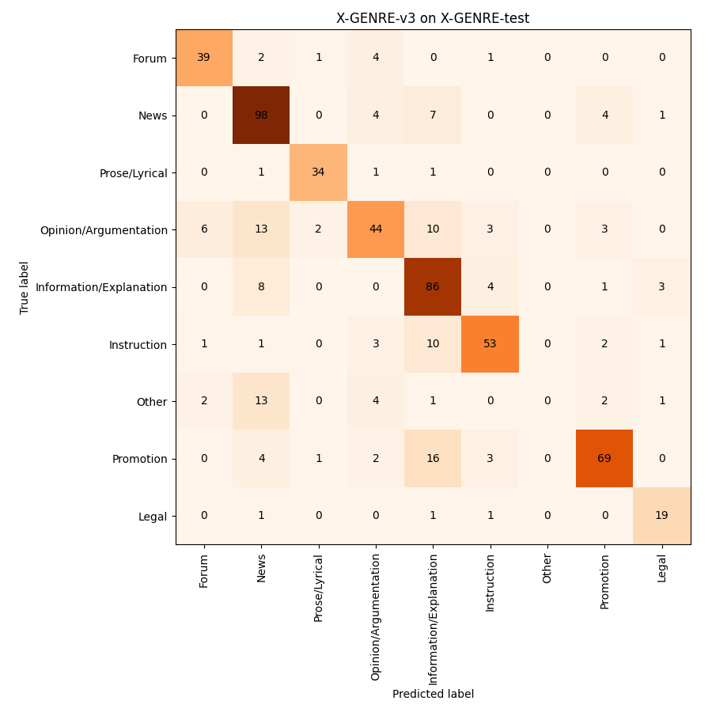

# Experiments with automatic annotation on the GINCO dataset

The GINCO dataset is fully manually annotated by 2 annotators. We compare the predictions by the GPT-4o model with the independent annotations of the 2 annotators.

Note: the final gold labels that are present in the GINCO dataset are in some cases different than the labels of either annotator - after annotating separately, the annotators discussed the cases in which they did not agree and decide for the final label together. Also, they introduced some labels later, at the discussion stage -- this is the case of Opinionated News which does not occur in the separate annotations of the annotators, but was later introduced when they decided for the final labels. -> We did the following interventions to the data prior to experiments and evaluation:
- removed instances with final labels that were later decided upon: *Opinionated News*, *Correspondence*, *Call*
- removed instances where one of the annotators marked the text as "unsuitable"
- removed instances where the final labels are different than the labels proposed by any of the two annotators (this indicates that the annotators later changed their mind and agreed to a completely different label)

The GINCO dataset is already split into train, dev and test splits. We use the dev split for prompt engineering experiments and then evaluate the GPT capabilities on train and test split.

The final dataset has 21 GINCO labels and 673 texts in the train+test split.

During prompt engineering, we experiment with various prompts - from just inputting a list of labels, to providing labels with descriptions, to providing step-by-step instructions in form of a decision tree.

Results of the prompt engineering (on dev split):

| setup                                             | macro_F1 | micro_F1 |
|---------------------------------------------------|----------|----------|
| GPT-4o-prompt_paper_description                   | 0.615298 | 0.619883 |
| GPT-4o-prompt_paper_description_hierarchy         | 0.588933 | 0.584795 |
| GPT-4o-prompt_guidelines_description_wo_features  | 0.586331 | 0.578947 |
| GPT-4o-prompt_guidelines_description              | 0.577268 | 0.573099 |
| GPT-4o-prompt_step_by_step                        | 0.574387 | 0.592375 |
| GPT-4o-prompt_guidelines_features                 | 0.573791 | 0.555556 |
| GPT-4o-prompt_guidelines_features_hierarchy       | 0.567674 | 0.567251 |
| GPT-4o-prompt_guidelines_description_wo_featur... | 0.560935 | 0.567251 |
| GPT-4o-prompt_guidelines_description_hierarchy    | 0.556092 | 0.567251 |
| GPT-4o-prompt_label_dictionary_only               | 0.546223 | 0.561404 |
| GPT-4o-prompt_label_hierarchy_only                | 0.537661 | 0.543860 |

For prediction, we use the `gpt-4o-2024-05-13` model and the prompt `prompt_paper_description` (labels with descriptions taken from the paper on the GINCO dataset). Prediction on 673 instances cost 4.71$ and took 8 minutes.
- The dataset with predictions is saved to `extension-to-genre/datasets/GINCO-train-and-test-split-with-GPT-predictions.jsonl`.

Results on train+test split: Macro f1: 0.571, Micro f1: 0.612 (train + test split)

Confusion matrix:



We can see that the model is incapable of predicting *List of Summaries/Excerpts* and *Other* and that it predicts all *Promotion* instances in more concrete categories *Promotion of Products* and *Promotion of Services*. The results clearly show the issues with the GINCO schema.

Inter-Annotator Agreement:

| pair           |   nominal Krippendorff Alpha |
|:---------------|-----------------------------:|
| Mojca & Taja   |                     0.77707  |
| Mojca & GPT-4o |                     0.577292 |
| Taja & GPT-4o  |                     0.554019 |

## Mapping the GINCO labels to X-GENRE

Since GINCO labels were shown to be problematic for the classifier, I extend the experiments to the X-GENRE schema. I map the labels provided by the two annotators from GINCO to the X-GENRE schema and use the GPT-4o with the prompt that contains the description of the X-GENRE labels to automatically annotate the instances.

Mapping:
```
mapping = {'FAQ': 'discarded', 'List of Summaries/Excerpts': 'discarded', 'Forum': 'Forum', 'Information/Explanation': 'Information/Explanation', 'Research Article': 'Information/Explanation', 'Instruction': 'Instruction', 'Recipe': 'Instruction', 'Legal/Regulation': 'Legal', 'Announcement': 'News', 'News/Reporting': 'News', 'Opinionated News': 'News', 'Opinion/Argumentation': 'Opinion/Argumentation', 'Review': 'Opinion/Argumentation', 'Call': 'Other', 'Correspondence': 'Other', 'Interview': 'Other', 'Other': 'Other', 'Script/Drama': 'Other', 'Invitation': 'Promotion', 'Promotion': 'Promotion', 'Promotion of a Product': 'Promotion', 'Promotion of Services': 'Promotion', 'Lyrical': 'Prose/Lyrical', 'Prose': 'Prose/Lyrical'}
```

Note: as part of the mapping, some labels were discarded (FAQ, List of Summaries/Excerpts) - including a label that posed the most problems (List of Summaries/Excerpts). Consequently, the results are reported on a smaller dataset: 581 instances.

Results: Macro f1: 0.726, Micro f1: 0.768

| pair                         |   nominal Krippendorff Alpha |
|:-----------------------------|-----------------------------:|
| Mojca_xgenre & Taja_xgenre   |                     0.810329 |
| Taja_xgenre & GPT-4o_xgenre  |                     0.703046 |
| Mojca_xgenre & GPT-4o_xgenre |                     0.701082 |

However, the agreement between the annotator and GPT-4o is still 10 point lower than the agreement between the annotators.


Agreement on label level between the two annotators and the GPT - calculated as F1 scores:

|                         |   Mojca_xgenre-Taja_xgenre |   Mojca_xgenre-GPT-4o_xgenre |   Taja_xgenre-GPT-4o_xgenre |
|:------------------------|---------------------------:|-----------------------------:|----------------------------:|
| Information/Explanation |                   0.785047 |                     0.695652 |                    0.666667 |
| Promotion               |                   0.861446 |                     0.83871  |                    0.801187 |
| News                    |                   0.875676 |                     0.735294 |                    0.741463 |
| Opinion/Argumentation   |                   0.859813 |                     0.688889 |                    0.755814 |
| Forum                   |                   0.961039 |                     0.909091 |                    0.923077 |
| Instruction             |                   0.818182 |                     0.769231 |                    0.84507  |
| Legal                   |                   0.896552 |                     0.848485 |                    0.882353 |
| Prose/Lyrical           |                   0.909091 |                     0.625    |                    0.705882 |
| Other                   |                   0.529412 |                     0.125    |                    0.230769 |


As we see, the problem is with the category "Other". Results if we discard this category - discarding 25 instances (4%):

Big improvement in scores: Macro f1: 0.811, Micro f1: 0.794

No improvement in the inter-annotator agreement:

| pair                         |   nominal Krippendorff Alpha |
|:-----------------------------|-----------------------------:|
| Mojca_xgenre & Taja_xgenre   |                     0.835074 |
| Taja_xgenre & GPT-4o_xgenre  |                     0.730825 |
| Mojca_xgenre & GPT-4o_xgenre |                     0.728125 |

# Experiments with automatic annotation on X-GENRE dataset

We automatically annotate the X-GENRE training dataset with genre labels, using GPT-4o and the label descriptions. Then we fine-tune base-sized XLM-RoBERTa model on the automatically annotated training dataset and compare its performance with the X-GENRE classifier - a model that was fine-tuned on manually-annotated labels.

We use the same hyperparameters and the same training data to fine-tune both versions of the models, only the labels are different (manually annotated vs. provided by GPT-4o).

We train and test each model three times and compare them with the performance of the X-GENRE classifier, available on HuggingFace.

We test the models on:
- X-GENRE-test: test split of the X-GENRE dataset
- EN-GINCO: English manually-annotated test set
- XL-GENRE: test set in 10 languages - note that it does not include label "Other", and that the test set is balanced by labels (~l0 labels per genre per language)

## X-GENRE-test

|                |   micro-F1 |   macro-F1 |
|:---------------|-----------:|-----------:|
| X-GENRE        |   0.797297 |   0.793577 |
| X-GENRE-GPT-v3 |   0.746622 |   0.690976 |
| X-GENRE-GPT-v2 |   0.743243 |   0.691659 |
| GPT            |   0.733108 |   0.67849  |
| X-GENRE-GPT-v1 |   0.731419 |   0.681137 |

|                         |   micro-F1 |   macro-F1 |
|:------------------------|-----------:|-----------:|
| X-GENRE-wo-other        |   0.809903 |   0.822179 |
| X-GENRE                 |   0.797297 |   0.793577 |
| X-GENRE-GPT-v3-wo-other |   0.776801 |   0.790648 |
| X-GENRE-GPT-v2-wo-other |   0.773286 |   0.7929   |
| GPT-wo-other            |   0.762742 |   0.778916 |
| X-GENRE-GPT-v1-wo-other |   0.760984 |   0.779575 |
| X-GENRE-GPT-v3          |   0.746622 |   0.690976 |
| X-GENRE-GPT-v2          |   0.743243 |   0.691659 |
| GPT                     |   0.733108 |   0.67849  |
| X-GENRE-GPT-v1          |   0.731419 |   0.681137 |

The X-GENRE-GPT models have lower macro-F1 especially because they struggle with prediction of the label "Other" which is not defined - this is because GPT-4o did not tend to annotate a text as "Other" - it always predicts some more concrete category. 

Confusion matrix for v3:



## EN-GINCO

|                |   micro-F1 |   macro-F1 |
|:---------------|-----------:|-----------:|
| X-GENRE        |   0.683824 |   0.686247 |
| X-GENRE-GPT-v2 |   0.709559 |   0.609737 |
| X-GENRE-GPT-v1 |   0.698529 |   0.596251 |
| GPT            |   0.694853 |   0.587247 |
| X-GENRE-GPT-v3 |   0.6875   |   0.580529 |

Without the instances, annotated as "Other":

|                         |   micro-F1 |   macro-F1 |
|:------------------------|-----------:|-----------:|
| X-GENRE-wo-other        |   0.710059 |   0.75192  |
| X-GENRE-GPT-v2-wo-other |   0.748062 |   0.747544 |
| X-GENRE-GPT-v1-wo-other |   0.736434 |   0.727297 |
| X-GENRE-GPT-v3-wo-other |   0.724806 |   0.704855 |
| GPT-wo-other            |   0.732558 |   0.704687 |
| X-GENRE                 |   0.683824 |   0.686247 |
| X-GENRE-GPT-v2          |   0.709559 |   0.609737 |
| X-GENRE-GPT-v1          |   0.698529 |   0.596251 |
| GPT                     |   0.694853 |   0.587247 |
| X-GENRE-GPT-v3          |   0.6875   |   0.580529 |

## X-GINCO

In this dataset, there is no "Other" label.

|                |   micro-F1 |   macro-F1 |
|:---------------|-----------:|-----------:|
| X-GENRE        |   0.845178 |   0.847914 |
| GPT            |   0.794937 |   0.799327 |
| X-GENRE-GPT-v1 |   0.763291 |   0.765596 |
| X-GENRE-GPT-v2 |   0.756962 |   0.762835 |
| X-GENRE-GPT-v3 |   0.751899 |   0.755035 |
